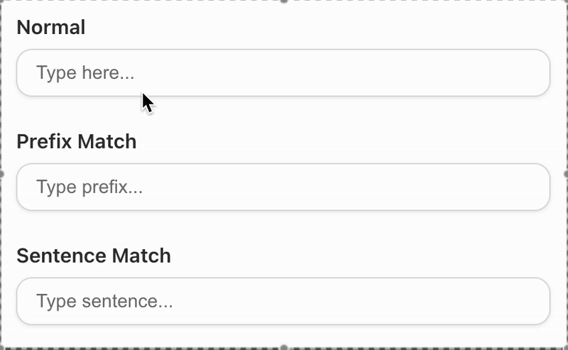

# Smart Icons Kit

<div align="center">


[](CHANGELOG.md)
[](LICENSE)
[](https://www.npmjs.com/package/smart-icons-kit)
[](https://github.com/Mak-3/smart-icons-kit/issues)
[](https://github.com/Mak-3/smart-icons-kit/pulls)
[](https://github.com/Mak-3/smart-icons-kit/graphs/contributors)
[](CONTRIBUTING.md)
[](https://hacktoberfest.com/)

**A smart icon component that works with both React web and React Native, featuring intelligent synonym matching, fuzzy prefix matching, and flexible prop spreading with fallback support.**

[Installation](#installation) • [Quick Start](#quick-start) • [Architecture](#-architecture) • [Features](#features) • [Documentation](#api-reference) • [Contributing](#contributing-via-hacktoberfest-2025)

</div>

---

## 🎥 Demo



---

## 📋 Table of Contents

1. [Installation](#installation)
2. [Quick Start](#quick-start)
3. [🏗️ Architecture](#-architecture)
4. [Features](#features)
5. [Comprehensive Icon Dataset](#comprehensive-icon-dataset)
6. [API Reference](#api-reference)
7. [Advanced Usage](#advanced-usage)
8. [Performance](#performance)
9. [Extensibility](#extensibility)
10. [Contributing via Hacktoberfest 2025](#contributing-via-hacktoberfest-2025)
11. [License](#license)

---

## 📦 Installation

### For React Web
```bash
npm install smart-icons-kit
```

### For React Native/Expo
```bash
npm install smart-icons-kit react-native-svg lucide-react-native buffer
```

> **Note**: React Native projects require additional dependencies for SVG support and Node.js polyfills.

---

## 🚀 Quick Start

### For React Web

```tsx
import { SmartIcon } from 'smart-icons-kit';
import { AlertCircle } from 'lucide-react';

function App() {
  return (
    <div>
      {/* Basic usage */}
      <SmartIcon name="home" size={24} color="blue" />
      
      {/* Synonym matching */}
      <SmartIcon name="house" size={24} color="red" /> {/* synonym for home */}
      
      {/* Fuzzy matching with prefixMatch prop */}
      <SmartIcon name="hom" prefixMatch size={24} color="green" /> {/* matches "home" */}
      
      {/* Fallback icon when name not found */}
      <SmartIcon 
        name="nonexistent-icon" 
        size={24} 
        color="orange"
        fallbackIcon={AlertCircle}
        aria-label="Unknown icon"
      />
    </div>
  );
}
```

### For React Native

#### Installation
```bash
npm install smart-icons-kit react-native-svg lucide-react-native buffer
```

#### Usage
```tsx
import { SmartIcon } from 'smart-icons-kit';
import { AlertCircle } from 'lucide-react-native';
import { View, TouchableOpacity } from 'react-native';

function App() {
  return (
    <View>
      {/* Basic usage */}
      <SmartIcon name="home" size={24} color="blue" />
      
      {/* Synonym matching */}
      <SmartIcon name="house" size={24} color="red" /> {/* synonym for home */}
      
      {/* Fuzzy matching with prefixMatch prop */}
      <SmartIcon name="hom" prefixMatch size={24} color="green" /> {/* matches "home" */}
      
      {/* Fallback icon when name not found */}
      <SmartIcon 
        name="nonexistent-icon" 
        size={24} 
        color="orange"
        fallbackIcon={AlertCircle}
        accessibilityLabel="Unknown icon"
      />
      
      {/* Interactive usage */}
      <TouchableOpacity onPress={() => console.log('Icon pressed!')}>
        <SmartIcon name="heart" size={24} color="red" />
      </TouchableOpacity>
    </View>
  );
}
```

---

## 🏗️ Architecture

### System Overview

```
┌─────────────────────────────────────────────────────────────────┐
│                    SMART ICONS KIT ARCHITECTURE                 │
├─────────────────────────────────────────────────────────────────┤
│                                                                 │
│  ┌─────────────────┐    ┌─────────────────────────────────────┐ │
│  │   USER LAYER    │    │           CORE COMPONENTS           │ │
│  │                 │    │                                     │ │
│  │ ┌─────────────┐ │    │  ┌─────────────────────────────────┐ │ │
│  │ │ React Web   │◄┼────┼──┤      SmartIcon Component        │ │ │
│  │ └─────────────┘ │    │  └─────────────────────────────────┘ │ │
│  │                 │    │                 │                    │ │
│  │ ┌─────────────┐ │    │  ┌──────────────┼──────────────────┐ │ │
│  │ │ React       │◄┼────┼──┤        Matching Engine          │ │ │
│  │ │ Native      │ │    │  │  • Exact Match (O1)             │ │ │
│  │ └─────────────┘ │    │  │  • Synonym Match                │ │ │
│  │                 │    │  │  • Prefix Match (Ok)            │ │ │
│  │ ┌─────────────┐ │    │  │  • Sentence Match (O n×k)       │ │ │
│  │ │   Expo      │◄┼────┼──└──────────────┼──────────────────┘ │ │
│  │ └─────────────┘ │    │                 │                    │ │
│  └─────────────────┘    │  ┌──────────────┼──────────────────┐ │ │
│                         │  │         Icon Registry           │ │ │
│  ┌─────────────────┐    │  │  • 200+ Lucide Icons           │ │ │
│  │   DATA LAYER    │    │  │  • Custom Icon Families        │ │ │
│  │                 │    │  │  • Fallback Handler            │ │ │
│  │ ┌─────────────┐ │    │  └──────────────┼──────────────────┘ │ │
│  │ │ Icon DB     │◄┼────┼─────────────────┤                    │ │
│  │ │ 200+ Icons  │ │    │  ┌──────────────┼──────────────────┐ │ │
│  │ └─────────────┘ │    │  │   Cross-Platform Adapter       │ │ │
│  │                 │    │  │  • React Web Renderer          │ │ │
│  │ ┌─────────────┐ │    │  │  • React Native Renderer       │ │ │
│  │ │  Synonym    │◄┼────┼──┤  • Prop Spreading Engine       │ │ │
│  │ │ Dictionary  │ │    │  └────────────────────────────────┘ │ │
│  │ │ 1000+ Terms │ │    │                                     │ │
│  │ └─────────────┘ │    └─────────────────────────────────────┘ │
│  │                 │                                            │
│  │ ┌─────────────┐ │    ┌─────────────────────────────────────┐ │
│  │ │  Category   │◄┼────┤       EXTERNAL DEPENDENCIES         │ │
│  │ │   Index     │ │    │                                     │ │
│  │ │  19 Cats    │ │    │  ┌─────────┐ ┌─────────┐ ┌─────────┐ │ │
│  │ └─────────────┘ │    │  │ lucide- │ │lucide- │ │ react-  │ │ │
│  └─────────────────┘    │  │  react  │ │ native │ │ native- │ │ │
│                         │  │         │ │         │ │   svg   │ │ │
│                         │  └─────────┘ └─────────┘ └─────────┘ │ │
│                         └─────────────────────────────────────┘ │
└─────────────────────────────────────────────────────────────────┘
```

### Architecture Components

#### 🎯 **Core Layer**
- **SmartIcon Component**: Main entry point with intelligent prop spreading
- **Matching Engine**: Multi-layered icon discovery with O(1) to O(n×k) performance
- **Icon Registry**: Centralized management with fallback support
- **Cross-Platform Adapter**: Unified API for React Web and React Native

#### 📊 **Data Layer**
- **Icon Database**: 200+ curated Lucide icons
- **Synonym Dictionary**: 1000+ intelligent synonyms
- **Category Index**: 19 organized icon categories

#### 🔗 **External Dependencies**
- **lucide-react**: Web icon components
- **lucide-react-native**: Mobile icon components  
- **react-native-svg**: SVG rendering for React Native

### Data Flow
1. **Input** → User provides icon name and props
2. **Matching** → Engine processes through 4 matching strategies
3. **Resolution** → Registry finds appropriate icon component
4. **Rendering** → Adapter renders using platform-specific components
5. **Spreading** → All additional props are passed to rendered icon

### Performance Characteristics
- **Exact Matches**: O(1) - Direct hash map lookup
- **Fuzzy Matches**: O(k) - Linear scan through synonyms
- **Sentence Matches**: O(n×k) - Word-by-word synonym matching
- **Memory**: Optimized icon loading with tree shaking support

---

## ✨ Features

- 🎯 **Smart Synonym Matching**: Icons can be found by multiple names (e.g., "home", "house", "building")
- 🔍 **Fuzzy Prefix Matching**: Find icons by typing 3+ characters with `prefixMatch` prop
- 📝 **Sentence Matching**: Extract icon names from sentences with `sentenceMatch` prop
- 🎨 **Flexible Prop Spreading**: All SVG/icon props are automatically supported
- 🛡️ **Fallback Icons**: Graceful fallback when icons aren't found
- 📱 **Cross-Platform**: Works with both React web and React Native
- 🔷 **TypeScript Support**: Full type definitions included
- ⚡ **High Performance**: O(1) lookups for exact matches, O(k) for fuzzy matches

---

## 📊 Comprehensive Icon Dataset

### Dataset Statistics

- **Total Icons**: 200+
- **React Web**: 200+ icons with 4-6 synonyms each
- **React Native**: 200+ icons with 4-6 synonyms each
- **Total Synonyms**: 1000+ unique synonyms
- **Categories**: 19+ organized categories

### 🗂️ Icon Categories

#### **1. Navigation & UI (10 icons)**
`home`, `search`, `menu`, `settings`, `user`, `users`, `bell`, `bellOff`, `eye`, `eyeOff`

#### **2. Arrows & Navigation (16 icons)**
`chevronDown`, `chevronUp`, `chevronLeft`, `chevronRight`, `chevronsDown`, `chevronsUp`, `chevronsLeft`, `chevronsRight`, `arrowDown`, `arrowUp`, `arrowLeft`, `arrowRight`, `arrowDownLeft`, `arrowDownRight`, `arrowUpLeft`, `arrowUpRight`

#### **3. Basic Actions (10 icons)**
`plus`, `minus`, `x`, `check`, `circle`, `square`, `triangle`, `star`, `heart`, `bookmark`

#### **4. Actions & Controls (15 icons)**
`edit`, `edit2`, `edit3`, `save`, `copy`, `scissors`, `trash`, `trash2`, `delete`, `download`, `upload`, `share`, `share2`, `link`, `link2`, `externalLink`, `refreshCw`, `refreshCcw`

#### **5. Media Controls (12 icons)**
`play`, `pause`, `skipBack`, `skipForward`, `fastForward`, `rewind`, `volume`, `volume1`, `volume2`, `volumeX`

#### **6. View Controls (8 icons)**
`maximize`, `minimize`, `maximize2`, `minimize2`, `rotateCw`, `rotateCcw`, `zoomIn`, `zoomOut`

#### **7. Communication (18 icons)**
`mail`, `messageCircle`, `messageSquare`, `phone`, `phoneCall`, `phoneIncoming`, `phoneOutgoing`, `phoneMissed`, `phoneOff`, `send`, `mic`, `micOff`, `headphones`, `speaker`, `video`, `videoOff`, `camera`, `cameraOff`

#### **8. Files & Folders (16 icons)**
`file`, `fileText`, `filePlus`, `fileMinus`, `folder`, `folderPlus`, `folderMinus`, `folderOpen`, `image`, `film`, `music`, `package`, `archive`, `inbox`, `clipboard`, `paperclip`

#### **9. Technology & Devices (18 icons)**
`smartphone`, `tablet`, `monitor`, `laptop`, `tv`, `watch`, `hardDrive`, `server`, `database`, `cpu`, `wifi`, `wifiOff`, `bluetooth`, `battery`, `batteryCharging`, `power`, `zap`, `zapOff`

#### **10. Social & Brand (8 icons)**
`facebook`, `twitter`, `instagram`, `linkedin`, `github`, `gitlab`, `youtube`, `slack`

#### **11. Business & Finance (15 icons)**
`dollarSign`, `creditCard`, `shoppingCart`, `shoppingBag`, `package2`, `truck`, `briefcase`, `building`, `trendingUp`, `trendingDown`, `barChart`, `barChart2`, `pieChart`, `activity`, `target`

#### **12. Time & Calendar (7 icons)**
`calendar`, `clock`, `timer`, `sunrise`, `sunset`, `moon`, `sun`

#### **13. Weather & Nature (16 icons)**
`cloud`, `cloudRain`, `cloudSnow`, `cloudLightning`, `cloudDrizzle`, `cloudOff`, `umbrella`, `droplet`, `wind`, `thermometer`, `compass`, `map`, `mapPin`, `globe`, `navigation`, `navigation2`

#### **14. Security & Privacy (6 icons)**
`lock`, `unlock`, `shield`, `shieldOff`, `key`, `fingerprint`

#### **15. Tools & Utilities (14 icons)**
`wrench`, `hammer`, `cog`, `sliders`, `filter`, `hash`, `tag`, `layers`, `grid`, `layout`, `sidebar`, `moreHorizontal`, `moreVertical`

#### **16. Text & Typography (12 icons)**
`type`, `bold`, `italic`, `underline`, `alignLeft`, `alignCenter`, `alignRight`, `alignJustify`, `list`, `listOrdered`, `quote`, `code`, `terminal`, `command`

#### **17. Status & Feedback (12 icons)**
`checkCircle`, `xCircle`, `alertCircle`, `alertTriangle`, `alertOctagon`, `info`, `helpCircle`, `thumbsUp`, `thumbsDown`, `award`, `trophy`, `medal`, `flag`

#### **18. Shapes & Symbols (6 icons)**
`hexagon`, `octagon`, `diamond`, `cross`, `bookmarkPlus`, `bookmarkMinus`

#### **19. Transport and Vehicle (5 icons)**
`car`, `plane`, `train`, `ship`, `bus`

#### **20. Miscellaneous (13 icons)**
`coffee`, `gamepad2`, `palette`, `brush`, `pen`, `pencil`, `eraser`, `ruler`, `gift`, `cake`, `pizza`, `apple`, `carrot`, `leaf`, `trees`, `flower`, `bug`, `fish`, `bird`, `cat`, `dog`

### Key Features of the Dataset

#### **Smart Synonym System**
Each icon has 4-6 carefully curated synonyms:
```typescript
home: {
  synonyms: ["home", "house", "building", "dwelling", "main", "dashboard"],
  component: Home,
}
```

#### **Comprehensive Coverage**
- **Navigation**: All common UI navigation patterns
- **Actions**: Complete set of user actions
- **Communication**: Full communication suite
- **Technology**: Modern device and tech icons
- **Business**: Professional business icons
- **Nature**: Weather and natural elements
- **Tools**: Development and utility tools

#### **No Duplicates**
- Each icon name is unique
- No conflicting synonyms
- Clean, organized structure

#### **Valid Icons**
- All icons exist in Lucide React/React Native
- Tested and verified imports
- Consistent naming conventions

---

## 📖 API Reference

### SmartIcon Props

#### Core Props
- `name: string` - Icon name or synonym (required)
- `family?: string` - Icon family (default: "lucide")
- `prefixMatch?: boolean` - Enable fuzzy matching for 3+ character inputs (default: false)
- `sentenceMatch?: boolean` - Enable sentence-based icon extraction (default: false)
- `fallbackIcon?: React.ComponentType<any>` - Fallback icon when name not found

#### Standard Props
All standard SVG props are supported through prop spreading:
- `size?: number` - Icon size
- `color?: string` - Icon color
- `stroke?: string` - Stroke color
- `fill?: string` - Fill color
- `strokeWidth?: number` - Stroke width
- `className?: string` - CSS class
- `style?: CSSProperties` - Inline styles
- `onClick?: (event) => void` - Click handler
- `onMouseEnter?: (event) => void` - Mouse enter handler
- `onMouseLeave?: (event) => void` - Mouse leave handler
- And many more...

---

## 🎯 Advanced Usage

### Fuzzy Matching

When `prefixMatch={true}` is enabled, the component will attempt to find icons using:

1. **Exact Match**: Direct lookup (O(1))
2. **Prefix Match**: Find synonyms that start with the input
3. **Contains Match**: Find synonyms that contain the input
4. **Reverse Prefix Match**: Find synonyms where input is a prefix

**Examples:**
```tsx
<SmartIcon name="hom" prefixMatch /> // matches "home"
<SmartIcon name="sea" prefixMatch /> // matches "search"
<SmartIcon name="set" prefixMatch /> // matches "settings"
<SmartIcon name="mai" prefixMatch /> // matches "mail"
```

### Sentence Matching

When `sentenceMatch={true}` is enabled, the component will:

1. **Split Input**: Break the input into individual words
2. **Reverse Search**: Start from the last word (most specific) and work backwards
3. **Word Matching**: Find the first word that matches an icon name or synonym
4. **Combined with Prefix**: If `prefixMatch` is also enabled, apply fuzzy matching to each word

**Examples:**
```tsx
<SmartIcon name="manali hotel" sentenceMatch /> // finds "hotel"
<SmartIcon name="luxury restaurant" sentenceMatch /> // finds "restaurant"
<SmartIcon name="red car" sentenceMatch /> // finds "car"
<SmartIcon name="coffee shop" sentenceMatch /> // finds "coffee"
<SmartIcon name="shopping mall" sentenceMatch /> // finds "shopping"
<SmartIcon name="general hospital" sentenceMatch /> // finds "hospital"
<SmartIcon name="elementary school" sentenceMatch /> // finds "school"
<SmartIcon name="office building" sentenceMatch /> // finds "building"
<SmartIcon name="private plane" sentenceMatch /> // finds "plane"
```

### Fallback Icons

When an icon name isn't found, you can provide a fallback:

```tsx
import { AlertCircle, HelpCircle } from 'lucide-react';

// Fallback for unknown icons
<SmartIcon 
  name="unknown-icon" 
  fallbackIcon={AlertCircle}
  size={24} 
  color="red"
/>

// Fallback with prefix matching
<SmartIcon 
  name="unk" 
  prefixMatch
  fallbackIcon={HelpCircle}
  size={24} 
  color="blue"
/>
```

### Spread Props Benefits

#### Key Benefits

1. **Future-Proof**: No need to update component when new SVG props are added
2. **Developer Experience**: Full TypeScript intellisense for all props
3. **Flexibility**: Event handlers, accessibility props, custom SVG attributes
4. **Fallback Support**: Graceful degradation when icons aren't found
5. **Cross-Platform**: Same API for React web and React Native

#### Real-World Examples

**Interactive Icons:**
```tsx
<SmartIcon 
  name="heart" 
  size={20} 
  color={liked ? "red" : "gray"}
  onClick={toggleLike}
  onMouseEnter={() => setHovered(true)}
  style={{ cursor: 'pointer', transform: hovered ? 'scale(1.1)' : 'scale(1)' }}
/>
```

**Custom Styled Icons:**
```tsx
<SmartIcon 
  name="star" 
  size={30} 
  fill="gold"
  stroke="none"
  className="star-icon"
  data-testid="rating-star"
/>
```

**Accessible Icons:**
```tsx
<SmartIcon 
  name="search" 
  size={24}
  aria-label="Search"
  role="img"
  focusable="true"
/>
```

---

## ⚡ Performance

### Lookup Performance
- **Exact Matches**: O(1) - Direct hash map lookup
- **Fuzzy Matches**: O(k) - where k is the number of synonyms
- **Sentence Matches**: O(n × k) - where n is words and k is synonyms
- **Memory**: O(n × m) - where n is icons and m is average synonyms per icon

### Bundle Size
- **React Web**: ~200 icons with synonyms
- **React Native**: ~200 icons with synonyms
- **Tree Shaking**: Only used icons are included

### Performance Impact
- **Zero overhead** - just standard React prop spreading
- **Same O(1) lookup performance** for exact matches
- **Same O(k) performance** for fuzzy matches
- **No additional bundle size**

---

## 🔧 Extensibility

### Adding New Icons

```tsx
import { registerIconFamily } from 'smart-icons-kit';
import { CustomIcon } from './CustomIcon';

registerIconFamily('custom', {
  myIcon: {
    synonyms: ['my-icon', 'custom-icon'],
    component: CustomIcon,
  },
});

// Now you can use it with all the same features
<SmartIcon name="my-icon" family="custom" />
<SmartIcon name="my-" prefixMatch family="custom" /> {/* fuzzy match */}
<SmartIcon 
  name="unknown-custom" 
  family="custom"
  fallbackIcon={AlertCircle}
  size={24}
/>
```

### Adding New Families

```tsx
import { registerIconFamily } from 'smart-icons-kit';
import * as FeatherIcons from 'feather-icons-react';

registerIconFamily('feather', {
  heart: {
    synonyms: ['heart', 'love', 'like'],
    component: FeatherIcons.Heart,
  },
  // Add more Feather icons...
});
```

### Benefits of Extensibility

1. **Comprehensive**: 200+ most common icons
2. **Smart**: 1000+ synonyms for easy discovery
3. **Fast**: O(1) lookup performance
4. **Flexible**: Spread props and fallback support
5. **Cross-Platform**: Works on React web and React Native
6. **Type-Safe**: Full TypeScript support
7. **Future-Proof**: Easy to extend with more icons

---

## 🤝 Contributing via Hacktoberfest 2025

Contributions are welcome! This project is participating in **Hacktoberfest 2025** 🎉

You can contribute by:
- 🎨 Adding new icons or synonyms
- 📚 Improving documentation
- ⚡ Enhancing performance or tests
- 🐛 Fixing bugs or issues
- 🌍 Adding internationalization support
- 💡 Proposing new features

### How to Contribute

1. **Fork this repository**
2. **Create a new branch** (`git checkout -b feature/amazing-feature`)
3. **Make your changes**
4. **Commit your changes** (`git commit -m 'Add some amazing feature'`)
5. **Push to the branch** (`git push origin feature/amazing-feature`)
6. **Open a Pull Request**

Please check [CONTRIBUTING.md](./CONTRIBUTING.md) for detailed guidelines.

### Good First Issues

Check out issues labeled with `good-first-issue` or `hacktoberfest` to get started!

---

## 📄 License

This project is licensed under the MIT License - see the [LICENSE](LICENSE) file for details.

---

## 🎉 Summary

Smart Icons Kit provides a comprehensive, high-performance icon solution for React applications with:

- ✅ **200+ icons** with 1000+ synonyms across 19 categories
- ✅ **Smart matching** with exact, fuzzy prefix, and sentence matching
- ✅ **Flexible props** supporting all SVG attributes and event handlers
- ✅ **Cross-platform** support for React web and React Native
- ✅ **Type-safe** with full TypeScript support
- ✅ **Extensible** architecture for custom icon families
- ✅ **High performance** with O(1) exact matches and O(k) fuzzy matches
- ✅ **Modular architecture** with clear separation of concerns

Perfect for modern web and mobile applications that need a comprehensive, intelligent icon system! 🚀

---

<div align="center">

**Made with ❤️ by [Mohammed Abdullah Khan](https://github.com/Mak-3)**

⭐ Star this repo if you find it useful!

</div>